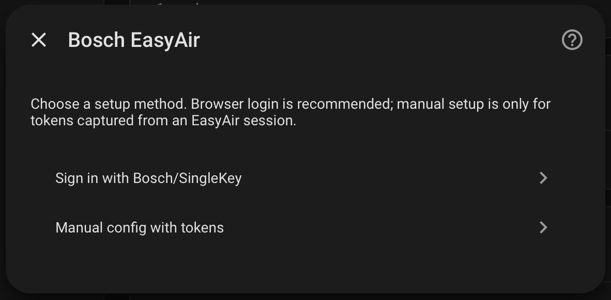
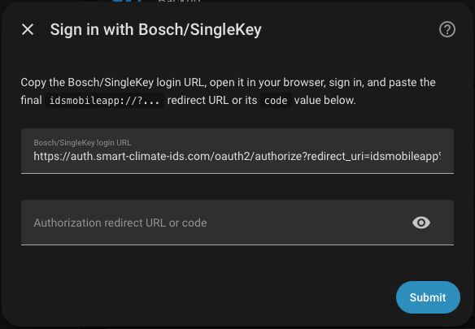
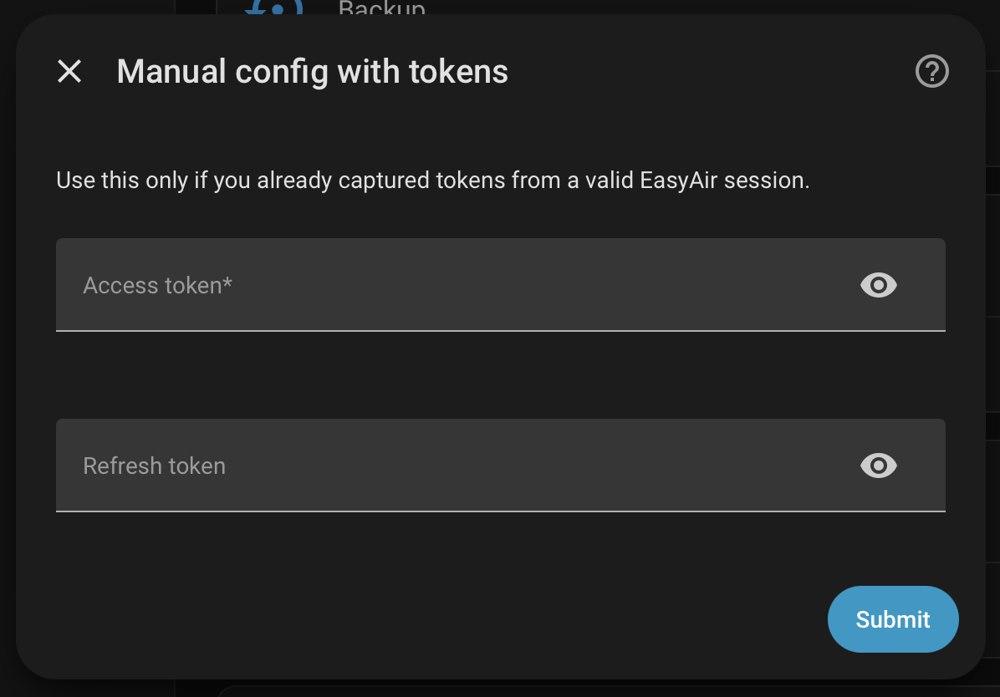

# Bosch EasyAir for Home Assistant

Experimental Home Assistant custom integration for Bosch EasyAir thermostats, with early focus on the Bosch BCC110.

Developing this for my own personal use, but if it helps you out, that's a plus.

This project is not affiliated with, endorsed by, or supported by Bosch.

## Status

This repository is the standalone home for the `bosch_easyair` custom integration. The integration code lives under:

```text
custom_components/bosch_easyair/
```

The first implementation targets the Bosch EasyAir / `smart-climate-ids` cloud API used by the BCC110. Local LAN control is not implemented.

## Installation

### HACS custom repository

1. In Home Assistant, open **HACS**.
2. Open the three-dot menu and choose **Custom repositories**.
3. Add this repository URL.
4. Select **Integration** as the category.
5. Install **Bosch EasyAir**.
6. Restart Home Assistant.
7. Go to **Settings > Devices & services > Add integration** and add **Bosch EasyAir**.

## Authentication

After tapping **Add integration** and selecting **Bosch EasyAir** you will be presented with the following dialog:



### Browser Login (Recommended)

Home Assistant can not directly recieve the OAuth callback from Bosch, so you are required to sign in via your browser and then copy & paste the final redirect URL/code back into the setup flow. 
There is also a basic browser extension available to make capturing this URL even easier, if you'd like.

1. Copy the provided login link and open it in your browser of choice. 
2. Enter your credentials for your Bosch Account
3. After successfully logging in, the browser will attempt to redirect to an "invalid" URL (should begin with `idsmobileapp://`). 
4. Copy that URL and paste it in to the setup dialog to finish the authorization flow. 

*Note:* You might need to open the web inspector to properly capture the redirect URL (or use the provided browser extension).



### Manual Token Entry (Advanced / Debugging)

If you are a more advanced user, or just happen to have your Access token (and optional Refresh token) handy, you can use the Manual Token Entry Setup flow. 



## Authentication Redirect URL Browser Extension

For your convenience, there is a browser extension in this repo that can be used to easily extract the redirect URL/code while logging in via the browser flow. 

It is not currently listed on an official app store, so you would need to install it manually yourself from this repo for now. 

[Instructions can be found here](browser-extension/easyair-auth-helper/README.md)


## Attribution

This standalone integration began as experimental Bosch EasyAir/BCC110 work developed while testing against [`bosch-thermostat/home-assistant-bosch-custom-component`](https://github.com/bosch-thermostat/home-assistant-bosch-custom-component), which is licensed under the Apache License 2.0.

## License

Apache License 2.0. See [LICENSE](LICENSE).
